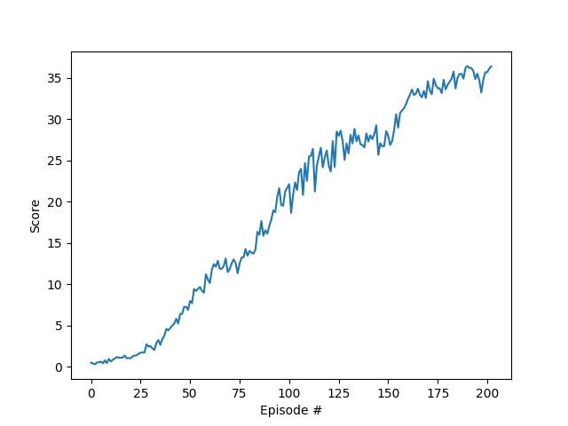

## Learning Algorithm
I used [DDPG](https://arxiv.org/abs/1509.02971) algorithm.

### Model architecture
#### Actor model
- Input layer: 33
- Fully connected layer 1: 300 with ReLu activation function
- Fully connected layer 1: 150 with ReLu activation function
- Output layer: 4 with tanh activation function
#### Critic model
- Input layer: 33
- Fully connected layer 1: 300 + 4(action) with ReLu activation function
- Fully connected layer 1: 150 with ReLu activation function
- Output layer: 1

#### Hyperparameters
|hyperparameter|value|
|--|--|
|replay buffer size | 1e6 |
| minibatch size | 512 |
| discount factor | 0.99 |
|soft update of target parameters | 1e-3 |
| learning rate of the actor | 1e-4 |
| learning rate of the critic | 1e-3 |
| learning every n step | 20 |
| lerning times in every learning step | 10 |

## Result
The DDPG solves in 103 episodes.

## Future Work
- Tuning hyperparameters
- Try to other algorithms like PPO and A2C.